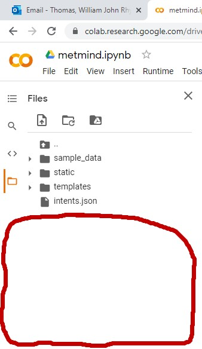
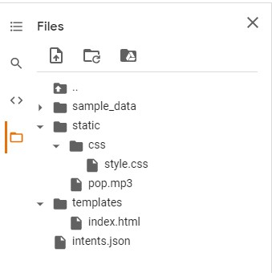
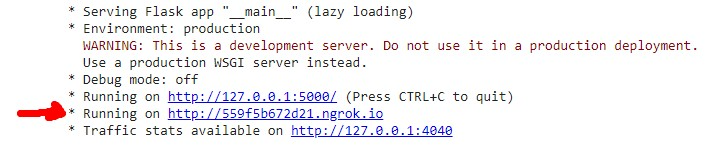
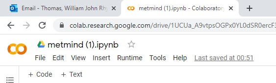
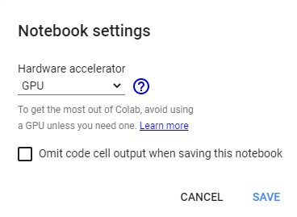

# How should an Artificial-intelligence Oriented Chat Bot Informant Be Implemented In Universities To Anonymously Support Students Through Covid-anxiety

## About the project

### Project Aim
The purpose of this project is to create a chatbot to combat covid-anxiety for students at the Cardiff Metropolitan University.

The project aims to conclude the most efficient development choices as to implement a chatbot technology to support the field of mental health and anxiety. Therefore, the main aim of the research is to create a chatbot to combat covid anxiety for students at the Cardiff Metropolitan University as to distribute and conclude the practicality of the development of chatbot technology in an academic environment as a tool that such professional councillors could utilise to reduce the burden of the ever-growing increase of anxiety disorder sufferer requests whilst signposting such suffers to appropriate self-management and professional services as to guide and combat such anxieties remotely

### Project Abstract
The Mental Health Sector towards anxiety counselling face a significant resource and engagement gap as a result of increased anxiety caused by the coronavirus. Research has shown that the coronavirus has influenced a significant deterioration in mental health for students as the coronavirus and corresponding lockdowns have resulted in anxiety levels skyrocketing during these troublesome times. This study aims to develop a chatbot to combat covid-anxiety for students at the Cardiff Metropolitan University to conclude the practicality of chatbot technologies in mental health and how such design practices influence the success of combating anxiety. Based on the research conducted towards the literature review on the coronavirus, general anxiety, covid anxiety and chatbot technologies, an online questionnaire was distributed to Cardiff Met students to collect data on the most relevant fears, anxiety-symptoms and self-management-techniques and reviewing such results through an interview with the universities wellbeing councillor to generate appropriate classifications/intents and responses for chatbot implementation. Analysis of the questionnaire has demonstrated that the majority of students are not suffering from a mental health disorder as the majority of symptoms indicate students could be suffering increased stress or low-tier anxiety but without the necessary amount of support then such symptoms can lead to more psychologically and physically damaging anxiety disorders. Statistics also indicate the fears of coronavirus are not as prevalent with students but indicate that the educational, occupational and financial struggles corresponding to the lockdowns and restrictions have presented more anxiety than fears of infection. These statistics have also brought to light the understanding of what covid anxiety looks like and what drives such anxieties as to support and reach out to such students which a councillor could utilise to better support a student and/or an individual. The results gathered from the literature review, questionnaire/interview and additional research have indicated that AI libraries capable of utilising ANN Neural Networking technologies through python with JSON and general intent and hidden layer rules of thumb and the utilisation of manual testing strategies such as functionality, regression, performance, user acceptance testing have resulted in high accuracy classifications with different synonyms and typing behaviour which on average reach 90% accuracy. These considerations proved successful during the distribution of a prototype and feedback questionnaire for user testing as participants demonstrate how the utilisation of such a powerful technology to distribute guidance and support corresponding to their designated fear/symptom have influenced the reduction of their anxiety levels and indicates that such technologies have significant utility as a tool to unburden the mental health sector whilst supporting anxiety on the basis that more research is done to include more possible recognizable synonyms, symptoms and fears.

## Project References

#### The projects UI design and flask implementation has been inspired from the works of
1: Huzaifsayed (2020) coronabot-chatterbot Available At: https://github.com/huzaifsayed/coronabot-chatterbot (Accessed: 15/09/2020)

#### The projects implementation of the neural network and dialog contextualisation has been inspired from the works of
1: ugik (2017) Tensorflow chat-bot model.ipynb Available At:  https://github.com/ugik/notebooks/blob/master/Tensorflow%20chat-bot%20model.ipynb (Accessed: 2/02/2020)

2: FreeBirdsCrew (2020) CHATBOTS - Using Natural Language Processing and Tensorflow Available At:  https://github.com/FreeBirdsCrew/AI_ChatBot_Python/blob/master/Contextual%20Chatbot%20-%20NLP%20and%20Tensorflow.ipynb (Accessed: 6/02/2020)

3: Tech With Tim (2019) Python Chat Bot Tutorial - Chatbot with Deep Learning (Part 3) Available At: https://www.youtube.com/watch?v=PzzHOvpqDYs&ab_channel=TechWithTim (Accessed: 16/10/2020)

4: Tech With Tim (2019) Python Chat Bot Tutorial - Chatbot with Deep Learning (Part 2) Available At: https://www.youtube.com/watch?v=ON5pGUJDNow (Accessed: 16/10/2020)

## Opening MetMind on google colab
1: Open https://colab.research.google.com/

3: Click on file

2: Click on open notebook

4: Click on upload

5: Upload the "metmind.ipynb" file

#### Uploading The Files
1: Click on the folder icon on the left side of the screen

2: Ignore the two generated folders

#### Uploading intents.json
1: Drag your downloaded intents.json under these generated folders[Into the empty space]

#### Uploading index.html

1: Right click in the empty space illustrated above and click new folder

2: Rename the folder to "templates"

3: Drag the index.html file into the newly created "templates" folder

#### Uploading pop.mp3 & styles.css
1: Once again, Right click in the empty space illustrated above and click new folder

2: Rename the folder to "static"

3: Drag the pop.mp3 file into the newly created "static" folder

4: Right click the newly created "static" folder and click new folder

5: Rename the folder to "css"

6: Drag the styles.css file into the newly created "css" folder

#### Uploading The Files: Confirmation

Your file storage should now look similar to this example
 

 
#### Running the code
1: Press "Runtime" on the top of the screen

2: Press run all

3: The code may time some time to compile. Please do not interrupt or close the program

4: Once the code is fully compiled then you will see this at the bottom of the screen[Scroll to the bottom]. You will need to click on the second link

 

#### Note 1 [resetting tensorflow graph error] 
If you are experiencing an error regarding resetting tensorflow graph then all you will need to do in order to fix this issue is:

Step 1: Press runtime [Located on the taskbar located at the top of the screen]

Step 2: Press restart and run all

#### Note 2 [Slow run/compile speed]
Some have informed me that they are experiencing issues regarding the run/compile speed of the code on google colab.
If you are experiencing any of these issues then you can easily combat against this by ensuring that you are running google colab via colabs GPU hardware accelerator:

Step 1: Press edit on the taskbar located near the top of the screen

Step 2: Press Notebook settings

Step 3: Click on the Hardware Accellerator Dropdown list and select GPU

Step 4: Press Save

 
#### NOTE 3: DO NOT CLOSE THE GOOGLE COLAB TAB WHILST THE CHATBOT IS RUNNING! THIS IS NEEDED FOR THE CHATBOTS FUNCTIONALITY

#### NOTE 4: Considering what browser you are using. Some web redirection functionalities may be blocked as a popup. Therefore, if you notice that a website should have opened [Indicated by the keyword "Redirect/Redirected" at the start of the message] then please click on the google colab tab and click on the pop-up blocked icon seen on the top left[As for google chrome] as to enable such pop ups in the future
